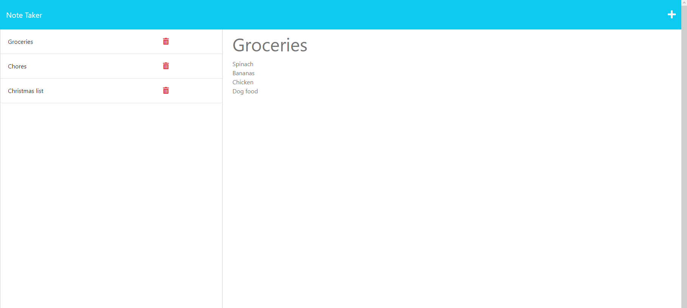

# NoteApp

## Decsription
This note taker application allows a user to enter a title and text of a note, which persists, so they can come back to see their notes later. When a user enters a title and the text of the note, a save button appears. When clicked, the note title and text are given a unique Id and saved to the db.json file. The title of the note then appears on the left side of their screen. Clicking on a previous note title displays the note on the screen. The user can also click the trashcan icon to delete any notes they no longer need. The application is deployed to heroku and you can see a screenshot of the notes page and a link to the deployed site below. 

[Here is a link to the deployed site on heroku](https://radiant-ravine-01589-dee562bfc599.herokuapp.com/notes)

